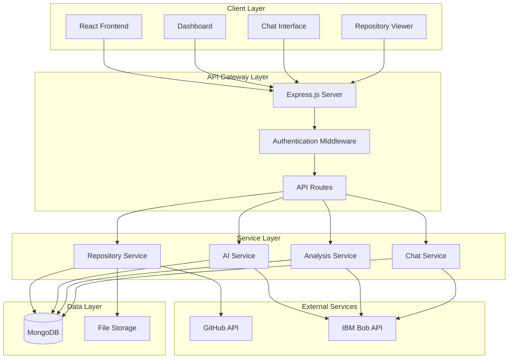
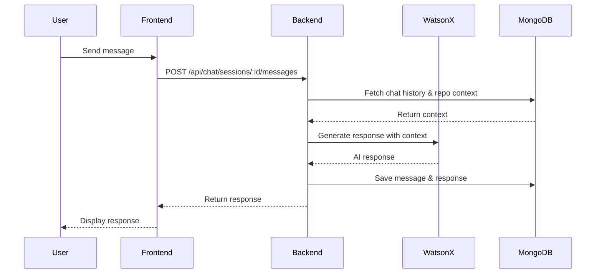

# CodeFlow AI - System Architecture & Implementation Plan

## Project Overview

**CodeFlow AI** is a web-based platform that brings **IBM Bob**, the AI SDLC partner, to your browser. IBM Bob is an AI development assistant that augments existing workflows and helps developers work confidently with real codebases. CodeFlow AI provides an intuitive web interface to leverage Bob's powerful capabilities for repository analysis, code understanding, and intelligent development assistance.

## Technology Stack

### Frontend
- **Framework**: React 18+
- **State Management**: Redux Toolkit / Context API
- **UI Library**: Material-UI (MUI) or Tailwind CSS
- **Code Editor**: Monaco Editor (VS Code editor component)
- **HTTP Client**: Axios
- **Routing**: React Router v6

### Backend
- **Runtime**: Node.js 18+ with Express.js
- **Language**: TypeScript
- **Authentication**: Passport.js with GitHub OAuth
- **Session Management**: express-session with MongoDB store
- **File Processing**: multer, adm-zip, simple-git
- **AI Integration**: IBM watsonx.ai SDK

### Database
- **Primary Database**: MongoDB 6+
- **ODM**: Mongoose
- **Collections**: users, repositories, chat_sessions, analysis_cache

### IBM Bob Integration
- **AI Service**: IBM Bob API
- **Modes**: Code, Ask, Plan, Advanced, Orchestrator
- **Tools**: File access, command execution, MCP support
- **Context Management**: Repository-aware conversations

### DevOps & Deployment
- **Containerization**: Docker & Docker Compose
- **Cloud Platform**: IBM Cloud
- **CI/CD**: GitHub Actions
- **Environment Management**: dotenv

## System Architecture



## Database Schema Design

### Users Collection
```javascript
{
  _id: ObjectId,
  githubId: String,
  username: String,
  email: String,
  avatarUrl: String,
  accessToken: String, // encrypted
  createdAt: Date,
  lastLogin: Date
}
```

### Repositories Collection
```javascript
{
  _id: ObjectId,
  userId: ObjectId,
  name: String,
  source: String, // 'github', 'upload', 'git-url'
  sourceUrl: String,
  fileStructure: Object,
  metadata: {
    language: String,
    framework: String,
    totalFiles: Number,
    totalLines: Number
  },
  analysisStatus: String, // 'pending', 'analyzing', 'completed', 'failed'
  analysis: {
    summary: String,
    architecture: String,
    dependencies: Array,
    keyModules: Array,
    generatedAt: Date
  },
  createdAt: Date,
  updatedAt: Date
}
```

### Chat Sessions Collection
```javascript
{
  _id: ObjectId,
  userId: ObjectId,
  repositoryId: ObjectId,
  messages: [{
    role: String, // 'user' or 'assistant'
    content: String,
    timestamp: Date,
    metadata: Object
  }],
  context: Object,
  createdAt: Date,
  updatedAt: Date
}
```

### Analysis Cache Collection
```javascript
{
  _id: ObjectId,
  repositoryId: ObjectId,
  type: String, // 'explanation', 'documentation', 'test'
  filePath: String,
  input: String,
  output: String,
  createdAt: Date,
  expiresAt: Date
}
```

## API Endpoints Design

### Authentication
- `POST /api/auth/github` - Initiate GitHub OAuth
- `GET /api/auth/github/callback` - OAuth callback
- `GET /api/auth/user` - Get current user
- `POST /api/auth/logout` - Logout user

### Repository Management
- `GET /api/repositories` - List user repositories
- `POST /api/repositories/github` - Connect GitHub repository
- `POST /api/repositories/upload` - Upload repository ZIP
- `POST /api/repositories/git-url` - Clone from Git URL
- `GET /api/repositories/:id` - Get repository details
- `DELETE /api/repositories/:id` - Delete repository
- `GET /api/repositories/:id/files` - Get file structure
- `GET /api/repositories/:id/files/:path` - Get file content

### AI Analysis
- `POST /api/analysis/:repoId/analyze` - Trigger full repository analysis
- `GET /api/analysis/:repoId/summary` - Get analysis summary
- `POST /api/analysis/:repoId/explain` - Explain code snippet
- `POST /api/analysis/:repoId/document` - Generate documentation
- `POST /api/analysis/:repoId/readme` - Generate README
- `POST /api/analysis/:repoId/tests` - Generate test cases

### Chat Interface
- `GET /api/chat/sessions` - List chat sessions
- `POST /api/chat/sessions` - Create new chat session
- `GET /api/chat/sessions/:id` - Get chat session
- `POST /api/chat/sessions/:id/messages` - Send message
- `DELETE /api/chat/sessions/:id` - Delete chat session

## Core Features Implementation

### 1. Repository Understanding

**Components:**
- Repository parser service
- File structure analyzer
- Dependency detector
- Architecture mapper

**Implementation:**
```javascript
// Analyze repository structure
async function analyzeRepository(repoId) {
  const repo = await Repository.findById(repoId);
  const files = await parseFileStructure(repo.path);
  
  // Extract metadata
  const metadata = {
    language: detectPrimaryLanguage(files),
    framework: detectFramework(files),
    totalFiles: files.length,
    totalLines: countTotalLines(files)
  };
  
  // Generate AI analysis using Bob
  const prompt = buildAnalysisPrompt(files, metadata);
  const analysis = await bobService.analyze(prompt, 'plan');
  
  // Save results
  await Repository.updateOne(
    { _id: repoId },
    { metadata, analysis, analysisStatus: 'completed' }
  );
}
```

### 2. AI-Powered Code Assistance

**Features:**
- Code explanation with context
- Inline comment generation
- Documentation generation
- Refactoring suggestions

**IBM Bob Integration:**
```javascript
async function explainCode(code, context) {
  const prompt = `
    Context: ${context.fileName} in ${context.projectType} project
    
    Explain this code in simple terms:
    \`\`\`${context.language}
    ${code}
    \`\`\`
    
    Provide:
    1. High-level purpose
    2. Key logic explanation
    3. Important details
  `;
  
  return await bobService.sendRequest(prompt, 'ask', {
    fileName: context.fileName,
    language: context.language,
    projectType: context.projectType
  });
}
```

### 3. Automated Testing

**Features:**
- Unit test generation
- Edge case identification
- Mock data creation
- Bug detection

**Implementation Strategy:**
- Analyze function signatures and logic
- Generate test cases using watsonx.ai
- Support multiple testing frameworks (Jest, Mocha, PyTest)
- Provide test coverage suggestions

### 4. Interactive AI Chat

**Features:**
- Repository-aware conversations
- Multi-turn dialogue support
- Context retention
- Code snippet references

**Chat Flow:**


## Frontend Architecture

### Component Structure
```
src/
├── components/
│   ├── auth/
│   │   ├── LoginButton.jsx
│   │   └── UserProfile.jsx
│   ├── dashboard/
│   │   ├── Dashboard.jsx
│   │   ├── RepositoryCard.jsx
│   │   └── QuickActions.jsx
│   ├── repository/
│   │   ├── RepositoryList.jsx
│   │   ├── RepositoryUpload.jsx
│   │   ├── FileExplorer.jsx
│   │   └── CodeViewer.jsx
│   ├── chat/
│   │   ├── ChatInterface.jsx
│   │   ├── MessageList.jsx
│   │   ├── MessageInput.jsx
│   │   └── ChatSidebar.jsx
│   ├── analysis/
│   │   ├── AnalysisSummary.jsx
│   │   ├── ArchitectureDiagram.jsx
│   │   └── DependencyGraph.jsx
│   └── common/
│       ├── Header.jsx
│       ├── Sidebar.jsx
│       └── LoadingSpinner.jsx
├── pages/
│   ├── Home.jsx
│   ├── Dashboard.jsx
│   ├── Repository.jsx
│   └── Chat.jsx
├── services/
│   ├── api.js
│   ├── auth.js
│   └── websocket.js
├── store/
│   ├── slices/
│   │   ├── authSlice.js
│   │   ├── repoSlice.js
│   │   └── chatSlice.js
│   └── store.js
└── utils/
    ├── constants.js
    └── helpers.js
```

### Key UI Screens

1. **Landing Page**
   - Hero section with value proposition
   - Feature highlights
   - GitHub OAuth login button

2. **Dashboard**
   - Repository list with status
   - Quick actions (upload, connect GitHub)
   - Recent chat sessions
   - Analysis statistics

3. **Repository View**
   - File explorer (tree view)
   - Code viewer with syntax highlighting
   - Analysis panel (summary, architecture)
   - Quick actions (explain, document, test)

4. **Chat Interface**
   - Message history
   - Input with code snippet support
   - Repository context selector
   - Suggested prompts

## Backend Architecture

### Service Layer Design

```javascript
// services/repositoryService.js
class RepositoryService {
  async connectGitHub(userId, repoUrl) { }
  async uploadZip(userId, file) { }
  async cloneGitUrl(userId, gitUrl) { }
  async parseRepository(repoId) { }
  async getFileStructure(repoId) { }
  async getFileContent(repoId, filePath) { }
}

// services/aiService.js
class AIService {
  async analyzeRepository(repoId) { }
  async explainCode(code, context) { }
  async generateDocumentation(code, context) { }
  async generateTests(code, context) { }
  async suggestRefactoring(code, context) { }
}

// services/chatService.js
class ChatService {
  async createSession(userId, repoId) { }
  async sendMessage(sessionId, message) { }
  async getResponse(sessionId, message, context) { }
  async getChatHistory(sessionId) { }
}
```

## IBM watsonx.ai Integration

### Configuration
```javascript
const { WatsonXAI } = require('@ibm-cloud/watsonx-ai');

const watsonxClient = WatsonXAI.newInstance({
  version: '2024-03-19',
  serviceUrl: process.env.WATSONX_URL,
  authenticator: new IamAuthenticator({
    apikey: process.env.WATSONX_API_KEY
  })
});
```

### Prompt Engineering Strategy

**Repository Analysis Prompt:**
```
You are IBM Bob, an expert software architect and code analyst.

Analyze this repository structure and provide:
1. High-level architecture summary
2. Key modules and their purposes
3. Technology stack and frameworks used
4. Main workflows and data flow
5. Potential improvement areas

Repository: {repo_name}
Files: {file_list}
Dependencies: {dependencies}
```

**Code Explanation Prompt:**
```
You are IBM Bob, a helpful code mentor.

Explain this code to a developer:
- What does it do?
- How does it work?
- Why is it structured this way?
- Any important patterns or best practices?

Code:
{code_snippet}

Context: {file_path} in {project_type}
```

## Security Considerations

1. **Authentication**
   - Secure GitHub OAuth flow
   - JWT token management
   - Session encryption

2. **Data Protection**
   - Encrypt sensitive tokens in database
   - Sanitize user inputs
   - Validate file uploads

3. **API Security**
   - Rate limiting
   - CORS configuration
   - Input validation middleware

4. **Repository Access**
   - User-scoped repository access
   - Temporary file storage cleanup
   - Access control for shared repositories

## Performance Optimization

1. **Caching Strategy**
   - Cache AI responses for identical queries
   - Redis for session management
   - CDN for static assets

2. **Async Processing**
   - Queue system for repository analysis
   - Background jobs for large repositories
   - Streaming responses for chat

3. **Database Optimization**
   - Index frequently queried fields
   - Pagination for large datasets
   - Aggregation pipelines for analytics

## Deployment Strategy

### Docker Configuration

**docker-compose.yml:**
```yaml
version: '3.8'
services:
  frontend:
    build: ./frontend
    ports:
      - "3000:3000"
    environment:
      - REACT_APP_API_URL=http://backend:5000
    depends_on:
      - backend

  backend:
    build: ./backend
    ports:
      - "5000:5000"
    environment:
      - MONGODB_URI=mongodb://mongo:27017/codeflow
      - WATSONX_API_KEY=${WATSONX_API_KEY}
      - GITHUB_CLIENT_ID=${GITHUB_CLIENT_ID}
      - GITHUB_CLIENT_SECRET=${GITHUB_CLIENT_SECRET}
    depends_on:
      - mongo

  mongo:
    image: mongo:6
    ports:
      - "27017:27017"
    volumes:
      - mongo-data:/data/db

volumes:
  mongo-data:
```

### IBM Cloud Deployment

1. **Container Registry**: Push Docker images to IBM Cloud Container Registry
2. **Kubernetes**: Deploy using IBM Cloud Kubernetes Service
3. **Database**: Use IBM Cloud Databases for MongoDB
4. **Secrets**: Manage credentials with IBM Cloud Secrets Manager
5. **Monitoring**: Set up IBM Cloud Monitoring and Logging

## Development Phases

### Phase 1: Foundation (Week 1-2)
- Project setup and structure
- Database schema implementation
- GitHub OAuth authentication
- Basic UI components

### Phase 2: Core Features (Week 3-4)
- Repository connection (all methods)
- File parsing and storage
- watsonx.ai integration
- Repository analysis service

### Phase 3: AI Features (Week 5-6)
- Code explanation
- Documentation generation
- Chat interface
- Context management

### Phase 4: Polish & Deploy (Week 7-8)
- UI/UX refinement
- Error handling
- Testing
- Docker configuration
- IBM Cloud deployment

## Success Metrics

1. **Functionality**
   - Successfully connect and analyze repositories
   - Generate accurate code explanations
   - Provide helpful chat responses

2. **Performance**
   - Repository analysis < 30 seconds for small repos
   - Chat response time < 3 seconds
   - UI load time < 2 seconds

3. **User Experience**
   - Intuitive navigation
   - Clear AI responses
   - Responsive design

## Future Enhancements

1. **Advanced Features**
   - Code search across repositories
   - Automated PR reviews
   - CI/CD integration
   - Team collaboration features

2. **AI Capabilities**
   - Multi-language support
   - Custom AI model fine-tuning
   - Code generation from descriptions
   - Security vulnerability detection

3. **Integrations**
   - GitLab, Bitbucket support
   - Jira integration
   - Slack notifications
   - VS Code extension

## Conclusion

This architecture provides a solid foundation for building CodeFlow AI as a proof-of-concept that demonstrates IBM Bob's capabilities in accelerating software development. The modular design allows for iterative development and easy extension of features.