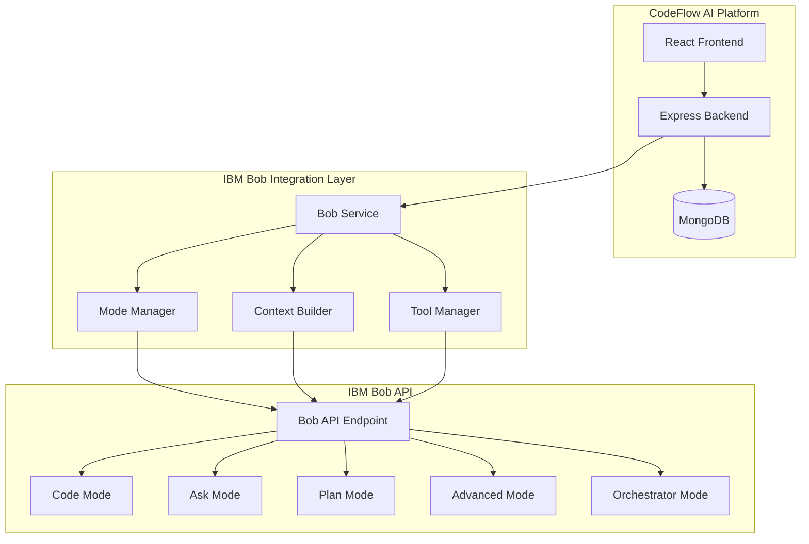

# IBM Bob Integration Guide

## Overview

This document provides detailed guidance on integrating IBM Bob, the AI SDLC partner, into the CodeFlow AI platform. IBM Bob brings powerful AI capabilities including code generation, explanation, refactoring, testing, and intelligent conversation.

## IBM Bob Capabilities

### Core Features

1. **Generate Code**: Turn natural language into working code
2. **Code Completion**: Single-line and multi-line autocompletions
3. **Refactor and Debug**: Clean up and fix existing code automatically
4. **Write and Update Docs**: Generate or update documentation from code
5. **Answer Questions**: Ask about your codebase and get explanations
6. **Automate Tasks**: Streamline repetitive workflows and boilerplate
7. **Create Files and Projects**: Scaffold new files and entire projects

### Specialized Modes

Bob adapts to specific needs with purpose-built modes:

| Mode | Purpose | Best For |
|------|---------|----------|
| **Code** | Write, modify, and refactor code | Implementation, bug fixes, code changes |
| **Ask** | Get answers and explanations | Understanding code, learning, documentation |
| **Plan** | Plan and design before implementation | Architecture, task breakdown, specs |
| **Advanced** | Extended capabilities for complex tasks | Multi-file changes, complex refactoring |
| **Orchestrator** | Coordinate multi-step projects | Large features, system redesigns |

### Powerful Tools

- **File Access**: Read and write files directly
- **Run Commands**: Execute terminal or shell commands
- **MCP (Model Context Protocol)**: Use external tools and integrations

## Integration Architecture



## Implementation

### 1. Bob Service Configuration

```javascript
// backend/src/services/bobService.js
const axios = require('axios');

class BobService {
  constructor() {
    this.apiKey = process.env.BOB_API_KEY;
    this.endpoint = process.env.BOB_API_ENDPOINT;
    this.model = process.env.BOB_MODEL || 'bob-default';
    this.timeout = 30000; // 30 seconds
  }

  /**
   * Send a request to IBM Bob
   * @param {string} prompt - The prompt to send to Bob
   * @param {string} mode - Bob's mode (code, ask, plan, advanced, orchestrator)
   * @param {object} context - Additional context for Bob
   * @returns {Promise<object>} Bob's response
   */
  async sendRequest(prompt, mode = 'code', context = {}) {
    try {
      const response = await axios.post(
        `${this.endpoint}/generate`,
        {
          prompt,
          mode,
          context: {
            ...context,
            repository: context.repositoryName,
            files: context.fileStructure,
            language: context.primaryLanguage
          },
          model: this.model,
          tools: this.getToolsForMode(mode)
        },
        {
          headers: {
            'Authorization': `Bearer ${this.apiKey}`,
            'Content-Type': 'application/json'
          },
          timeout: this.timeout
        }
      );

      return {
        success: true,
        content: response.data.content,
        mode: response.data.mode,
        metadata: response.data.metadata
      };
    } catch (error) {
      console.error('Bob API Error:', error.message);
      throw new Error(`Failed to get response from Bob: ${error.message}`);
    }
  }

  /**
   * Get available tools for a specific mode
   */
  getToolsForMode(mode) {
    const tools = {
      code: ['read_file', 'write_file', 'apply_diff', 'execute_command'],
      ask: ['read_file', 'search_files', 'list_files'],
      plan: ['read_file', 'list_files', 'search_files'],
      advanced: ['read_file', 'write_file', 'apply_diff', 'execute_command', 'mcp_tools'],
      orchestrator: ['all']
    };

    return tools[mode] || tools.code;
  }

  /**
   * Analyze repository with Bob (Plan mode)
   */
  async analyzeRepository(repoData) {
    const prompt = `Analyze this repository and provide a comprehensive summary:

Repository: ${repoData.name}
Language: ${repoData.metadata.language}
Framework: ${repoData.metadata.framework}
Total Files: ${repoData.metadata.totalFiles}
Total Lines: ${repoData.metadata.totalLines}

File Structure:
${JSON.stringify(repoData.fileStructure, null, 2)}

Provide:
1. High-level architecture summary
2. Key modules and their purposes
3. Technology stack analysis
4. Main workflows and data flow
5. Potential improvement areas`;

    return await this.sendRequest(prompt, 'plan', {
      repositoryName: repoData.name,
      fileStructure: repoData.fileStructure,
      primaryLanguage: repoData.metadata.language
    });
  }

  /**
   * Explain code with Bob (Ask mode)
   */
  async explainCode(code, fileContext) {
    const prompt = `Explain this code clearly:

File: ${fileContext.filePath}
Language: ${fileContext.language}

\`\`\`${fileContext.language}
${code}
\`\`\`

Provide:
1. What does this code do?
2. How does it work?
3. Important patterns or best practices
4. Any potential issues`;

    return await this.sendRequest(prompt, 'ask', {
      filePath: fileContext.filePath,
      language: fileContext.language,
      repositoryName: fileContext.repositoryName
    });
  }

  /**
   * Generate documentation with Bob (Code mode)
   */
  async generateDocumentation(code, fileContext) {
    const prompt = `Generate comprehensive documentation for this code:

File: ${fileContext.filePath}
Language: ${fileContext.language}

\`\`\`${fileContext.language}
${code}
\`\`\`

Generate:
1. Function/class descriptions
2. Parameters and return values
3. Usage examples
4. Important notes

Format as ${this.getDocFormat(fileContext.language)} comments.`;

    return await this.sendRequest(prompt, 'code', {
      filePath: fileContext.filePath,
      language: fileContext.language,
      action: 'document'
    });
  }

  /**
   * Generate tests with Bob (Code mode)
   */
  async generateTests(code, fileContext) {
    const prompt = `Generate comprehensive unit tests for this code:

File: ${fileContext.filePath}
Language: ${fileContext.language}
Test Framework: ${fileContext.testFramework || 'Jest'}

\`\`\`${fileContext.language}
${code}
\`\`\`

Generate:
1. Test cases for normal scenarios
2. Edge cases
3. Error handling tests
4. Mock data if needed

Provide complete, runnable test code.`;

    return await this.sendRequest(prompt, 'code', {
      filePath: fileContext.filePath,
      language: fileContext.language,
      testFramework: fileContext.testFramework,
      action: 'test'
    });
  }

  /**
   * Refactor code with Bob (Code mode)
   */
  async refactorCode(code, fileContext, goals) {
    const prompt = `Refactor this code to improve:
${goals.map(g => `- ${g}`).join('\n')}

File: ${fileContext.filePath}
Language: ${fileContext.language}

Current code:
\`\`\`${fileContext.language}
${code}
\`\`\`

Provide:
1. Refactored code
2. Explanation of changes
3. Benefits of the refactoring`;

    return await this.sendRequest(prompt, 'code', {
      filePath: fileContext.filePath,
      language: fileContext.language,
      action: 'refactor',
      goals
    });
  }

  /**
   * Chat with Bob (Ask mode by default, can switch)
   */
  async chat(message, chatContext) {
    const prompt = `${this.buildChatContext(chatContext)}

User: ${message}

Bob:`;

    return await this.sendRequest(prompt, chatContext.mode || 'ask', {
      repositoryName: chatContext.repositoryName,
      conversationHistory: chatContext.history,
      currentFile: chatContext.currentFile
    });
  }

  /**
   * Build context for chat conversations
   */
  buildChatContext(chatContext) {
    let context = `Repository: ${chatContext.repositoryName}\n`;
    
    if (chatContext.language) {
      context += `Language: ${chatContext.language}\n`;
    }
    
    if (chatContext.currentFile) {
      context += `Current File: ${chatContext.currentFile}\n`;
    }
    
    if (chatContext.history && chatContext.history.length > 0) {
      context += '\nConversation History:\n';
      chatContext.history.slice(-5).forEach(msg => {
        context += `${msg.role}: ${msg.content}\n`;
      });
    }
    
    return context;
  }

  /**
   * Get documentation format for language
   */
  getDocFormat(language) {
    const formats = {
      javascript: 'JSDoc',
      typescript: 'TSDoc',
      python: 'docstring',
      java: 'Javadoc',
      go: 'GoDoc',
      ruby: 'RDoc',
      php: 'PHPDoc'
    };

    return formats[language.toLowerCase()] || 'inline';
  }

  /**
   * Switch Bob's mode during conversation
   */
  async switchMode(sessionId, newMode) {
    // Update session mode in database
    await ChatSession.updateOne(
      { _id: sessionId },
      { 'context.mode': newMode }
    );

    return {
      success: true,
      mode: newMode,
      message: `Switched to ${newMode} mode`
    };
  }
}

module.exports = new BobService();
```

### 2. API Endpoints for Bob Integration

```javascript
// backend/src/routes/bob.js
const express = require('express');
const router = express.Router();
const bobService = require('../services/bobService');
const Repository = require('../models/Repository');
const { authenticate } = require('../middleware/auth');

// Analyze repository
router.post('/analyze/:repoId', authenticate, async (req, res) => {
  try {
    const repository = await Repository.findById(req.params.repoId);
    
    if (!repository) {
      return res.status(404).json({ error: 'Repository not found' });
    }

    const analysis = await bobService.analyzeRepository(repository);
    
    // Save analysis
    repository.analysis = {
      summary: analysis.content,
      generatedAt: new Date()
    };
    repository.analysisStatus = 'completed';
    await repository.save();

    res.json({ analysis: analysis.content });
  } catch (error) {
    res.status(500).json({ error: error.message });
  }
});

// Explain code
router.post('/explain', authenticate, async (req, res) => {
  try {
    const { code, filePath, language, repositoryName } = req.body;
    
    const explanation = await bobService.explainCode(code, {
      filePath,
      language,
      repositoryName
    });

    res.json({ explanation: explanation.content });
  } catch (error) {
    res.status(500).json({ error: error.message });
  }
});

// Generate documentation
router.post('/document', authenticate, async (req, res) => {
  try {
    const { code, filePath, language } = req.body;
    
    const documentation = await bobService.generateDocumentation(code, {
      filePath,
      language
    });

    res.json({ documentation: documentation.content });
  } catch (error) {
    res.status(500).json({ error: error.message });
  }
});

// Generate tests
router.post('/generate-tests', authenticate, async (req, res) => {
  try {
    const { code, filePath, language, testFramework } = req.body;
    
    const tests = await bobService.generateTests(code, {
      filePath,
      language,
      testFramework
    });

    res.json({ tests: tests.content });
  } catch (error) {
    res.status(500).json({ error: error.message });
  }
});

// Refactor code
router.post('/refactor', authenticate, async (req, res) => {
  try {
    const { code, filePath, language, goals } = req.body;
    
    const refactored = await bobService.refactorCode(code, {
      filePath,
      language
    }, goals);

    res.json({ refactored: refactored.content });
  } catch (error) {
    res.status(500).json({ error: error.message });
  }
});

// Chat with Bob
router.post('/chat', authenticate, async (req, res) => {
  try {
    const { message, sessionId, repositoryName, mode } = req.body;
    
    // Get chat history
    const session = await ChatSession.findById(sessionId);
    
    const response = await bobService.chat(message, {
      repositoryName,
      mode: mode || session.context.mode || 'ask',
      history: session.messages,
      currentFile: session.context.currentFile
    });

    // Save message and response
    session.messages.push(
      { role: 'user', content: message },
      { role: 'assistant', content: response.content }
    );
    await session.save();

    res.json({ response: response.content, mode: response.mode });
  } catch (error) {
    res.status(500).json({ error: error.message });
  }
});

// Switch Bob's mode
router.post('/mode/:sessionId', authenticate, async (req, res) => {
  try {
    const { mode } = req.body;
    const result = await bobService.switchMode(req.params.sessionId, mode);
    res.json(result);
  } catch (error) {
    res.status(500).json({ error: error.message });
  }
});

module.exports = router;
```

### 3. Frontend Integration

```jsx
// frontend/src/services/bobService.js
import api from './api';

class BobService {
  async analyzeRepository(repoId) {
    const response = await api.post(`/bob/analyze/${repoId}`);
    return response.data;
  }

  async explainCode(code, context) {
    const response = await api.post('/bob/explain', {
      code,
      ...context
    });
    return response.data;
  }

  async generateDocumentation(code, context) {
    const response = await api.post('/bob/document', {
      code,
      ...context
    });
    return response.data;
  }

  async generateTests(code, context) {
    const response = await api.post('/bob/generate-tests', {
      code,
      ...context
    });
    return response.data;
  }

  async refactorCode(code, context, goals) {
    const response = await api.post('/bob/refactor', {
      code,
      ...context,
      goals
    });
    return response.data;
  }

  async sendMessage(message, sessionId, repositoryName, mode) {
    const response = await api.post('/bob/chat', {
      message,
      sessionId,
      repositoryName,
      mode
    });
    return response.data;
  }

  async switchMode(sessionId, mode) {
    const response = await api.post(`/bob/mode/${sessionId}`, { mode });
    return response.data;
  }
}

export default new BobService();
```

## Best Practices

### 1. Prompt Engineering

**Be Specific**: Provide clear, detailed prompts
```javascript
// Good
"Create a React component that displays a sortable table of user data with pagination"

// Less effective
"Make me a table component"
```

**Provide Context**: Include relevant information
```javascript
const context = {
  repositoryName: 'my-app',
  language: 'javascript',
  framework: 'React',
  filePath: 'src/components/UserTable.jsx'
};
```

### 2. Mode Selection

- **Code Mode**: For implementation and modifications
- **Ask Mode**: For understanding and explanations
- **Plan Mode**: For architecture and design
- **Advanced Mode**: For complex multi-file operations
- **Orchestrator Mode**: For large-scale refactoring

### 3. Error Handling

```javascript
try {
  const response = await bobService.explainCode(code, context);
  // Handle success
} catch (error) {
  if (error.response?.status === 429) {
    // Rate limit exceeded
    showNotification('Too many requests. Please wait.');
  } else if (error.response?.status === 401) {
    // Authentication error
    redirectToLogin();
  } else {
    // General error
    showNotification('Failed to get response from Bob');
  }
}
```

### 4. Context Management

Maintain conversation context for better responses:

```javascript
const chatContext = {
  repositoryName: repo.name,
  language: repo.metadata.language,
  history: session.messages.slice(-10), // Last 10 messages
  currentFile: currentlyViewingFile,
  mode: 'ask'
};
```

## Security Considerations

1. **API Key Protection**: Never expose Bob API keys in frontend code
2. **Rate Limiting**: Implement rate limiting to prevent abuse
3. **Input Validation**: Validate all inputs before sending to Bob
4. **Output Sanitization**: Sanitize Bob's responses before displaying
5. **Access Control**: Ensure users can only access their own repositories

## Performance Optimization

1. **Caching**: Cache Bob's responses for identical queries
2. **Streaming**: Use streaming for long responses
3. **Batch Operations**: Batch multiple requests when possible
4. **Timeout Handling**: Set appropriate timeouts for API calls

## Monitoring and Analytics

Track Bob usage for insights:

```javascript
// Log Bob interactions
await BobAnalytics.create({
  userId: req.user.id,
  action: 'explain_code',
  mode: 'ask',
  repositoryId: repo.id,
  tokensUsed: response.metadata.tokens,
  responseTime: response.metadata.duration,
  timestamp: new Date()
});
```

## Troubleshooting

### Common Issues

1. **Timeout Errors**: Increase timeout for complex operations
2. **Rate Limiting**: Implement exponential backoff
3. **Context Too Large**: Limit context size for API calls
4. **Mode Confusion**: Explicitly specify mode for each request

## Future Enhancements

1. **MCP Integration**: Add Model Context Protocol support
2. **Custom Tools**: Create custom tools for Bob
3. **Fine-tuning**: Fine-tune Bob for specific use cases
4. **Bobalytics**: Integrate usage analytics and optimization
5. **Team Features**: Add collaboration features with Bob

---

This integration guide provides a comprehensive foundation for leveraging IBM Bob's capabilities in CodeFlow AI.